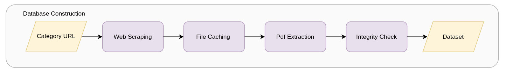

# Code directory

The `01-code` directory contains the core scripts for each stage of the product‑catalogue processing pipeline. It’s organized into four subfolders, each responsible for a distinct phase:

---

## 1. Download_Pdfs

  

**Objective:**  
Fetch and validate PDF catalogues from DigiKey product pages.

**Main Script:**  
- `00-download_pdfs.py`

**Workflow:**  
1. Read category URLs from `urls.txt`.  
2. Generate paginated links (e.g. `category?page=1`, `category?page=2`, …).  
3. Download up to 100 PDFs per page.  
4. Discard corrupted or non‑PDF files.

**Helpers:**  
- `aux_download_pdfs.py` (HTTP requests, file validation, retry logic)

---

## 2. Tables-Text-Images to .txt (TTI.txt)

**Objective:**  
Extract tables, text blocks, and images from PDFs and normalize them into clean `.txt` files.

**Main Script(s):**  
- *e.g.* `01-extract_pdf.py`

**Workflow:**  
1. Parse PDF pages for text, tables, and embedded images.  
2. Apply cleanup rules (remove headers/footers, dedupe).  
3. Write a unified plain‑text file for each document.

---

## 3. Embeddings

**Objective:**  
Transform cleaned text into vector embeddings using multiple strategies.

**Main Script(s):**  
- `02-embed_tfidf.py`  
- `02-embed_word2vec.py`  
- `02-embed_transformer.py`

**Workflow:**  
1. Load cleaned `.txt` files.  
2. Apply one of three embedding methods (TF‑IDF, Word2Vec, transformer-based).  
3. Save resulting embeddings to disk.

---

## 4. Classifiers

**Objective:**  
Train and evaluate classifiers on the precomputed embeddings.

**Main Script(s):**  
- `03-train_classifiers.py`  
- `03-evaluate_models.py`

**Workflow:**  
1. Load embedding datasets.  
2. Train multiple classification models.  
3. Evaluate performance (accuracy, precision, recall, confusion matrix).  
4. Export performance reports and model artifacts.

---

> **Tip:** For detailed usage and parameter options, refer to each script’s docstring or header comments.
