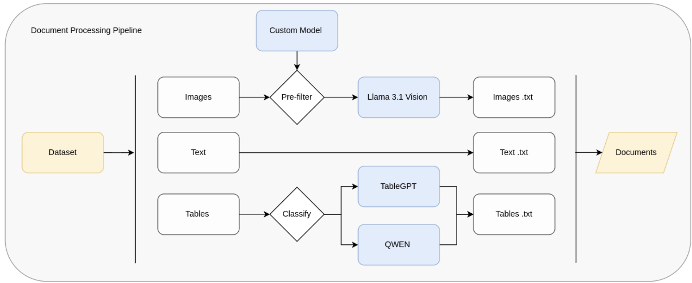

# 📄 TTI.txt – Tables-Text-Images Dataset for Industrial PDF Categorization

## Overview

**TTI.txt** (Tables-Text-Images.txt) is a custom dataset and PDF-processing pipeline developed during the _Research Internship 2: Categorization of Textual Industrial (Technical) Reports_ at the **MICCS Lab, University of Antwerp**. This project addresses a common limitation in existing PDF-to-text conversion tools: the loss of structural and visual context in technical documents, particularly those containing tables, charts, and images.

To bridge this gap, we created a unified pipeline that extracts and integrates all relevant components—textual, tabular, and graphical—into a single raw-text representation. This format serves as the foundation for downstream semantic analysis, such as document classification and information retrieval tasks.

  

## Context and Motivation

Technical documents like **Product Catalogues (PCs)** contain richly formatted information, combining structured data (e.g., specification tables) with descriptive text. These catalogs play a crucial role in industrial documentation and are often overlooked by traditional NLP pipelines due to their formatting complexity.

Our dataset comprises categorized product documentation sourced from the DigiKey platform. Each PDF has been validated and labeled according to product category, with approximately **100 documents per class**. The result is a diverse, well-structured corpus suitable for a wide range of **NLP and IR tasks** in the industrial domain.

## Semantic Preservation for Downstream Tasks

Preserving all multimodal content—text, tables, and images—in a semantically coherent raw .txt format is essential for enabling meaningful embedding and classification tasks. By maintaining both the structure and the informational context of each document, we ensure that semantic signals from tabular and visual data are not lost during preprocessing. This enhances the representational quality of the dataset, making it more suitable for advanced downstream applications.

We also explore how various embedding techniques are affected by corpus composition and formatting. Furthermore, we fine-tune an array of classifiers to determine the optimal configuration for document categorization, assessing performance across traditional methods.

## Applications

This dataset is designed to support tasks such as:

- Industrial document classification  
- Semantic search and retrieval  
- Information extraction from structured technical content  
- Training and evaluation of models handling multi-modal PDF input

## 🚧 Project Structure

* 00-documentation/ ← more in‑depth information live here
* 01-code/ ← your core pipeline and scripts
* 02-data/ ← raw PDFs, intermediate files, outputs

> _Note: each subfolder contains its own README with usage details—no quick‐start code snippet is needed here._

## 📂 Output / Artifacts

After running the pipeline, you’ll find the processed files under `02-data/01-pdfs/label_x/file_y/ ... `:

## ⚙️ Configuration

- `config.yml` (or `config.json`)  
  - input/output directories  
  - parser/OCR backends  
  - logging levels  

## 📝 License
This project is released under the MIT License. See LICENSE for details.

## 📬 Contact & Acknowledgments

| **Role**             | **Name**                                   |
| -------------------- | ------------------------------------------ |
| Lead Developer       | Pablo de Vicente                           |
| Promotor             | Prof. Moharram Challenger                  |
| Co‑promotor          | Alireza Khalilipour                        |
| Lab                  | MICCS Lab, University of Antwerp           |

**Acknowledgments**  
Thanks to all collaborators and DigiKey for data access.
